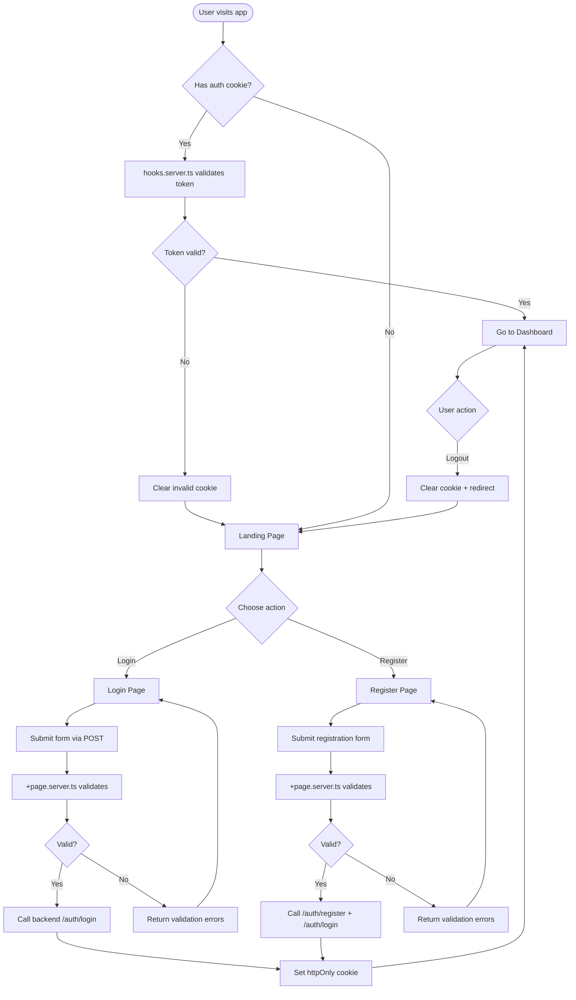
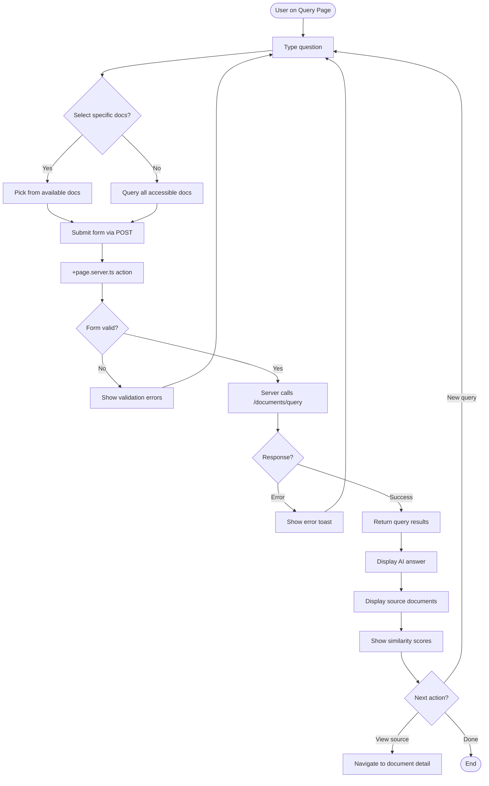

# Frontend Specification - RAG Education System

> Dokumentasi lengkap untuk pengembangan frontend menggunakan **SvelteKit 5 + TypeScript + SSR + shadcn-svelte**

---

## Table of Contents

1. [Overview](#overview)
2. [Tech Stack](#tech-stack)
3. [User Roles & Permissions](#user-roles--permissions)
4. [User Flow Diagrams](#user-flow-diagrams)
5. [API Integration](#api-integration)
6. [Authentication Architecture](#authentication-architecture)
7. [Pages & Components](#pages--components)
8. [State Management](#state-management)
9. [Component Architecture](#component-architecture)
10. [Routing Structure](#routing-structure)
11. [TypeScript Interfaces](#typescript-interfaces)
12. [UI/UX Guidelines](#uiux-guidelines)
13. [Security Considerations](#security-considerations)
14. [Error Handling](#error-handling)
15. [Performance Optimization](#performance-optimization)
16. [Development Setup](#development-setup)
17. [Implementation Checklist](#implementation-checklist)

---

## Overview

**RAG Education System** adalah platform pendidikan yang menggunakan teknologi Retrieval-Augmented Generation (RAG) untuk membantu mahasiswa dan dosen dalam mencari informasi dari dokumen-dokumen pendidikan.

### Key Features
- **Document Management**: Upload dan kelola dokumen PDF dan gambar
- **OCR Processing**: Ekstraksi teks otomatis dari gambar menggunakan Tesseract
- **RAG Query**: Tanya jawab berbasis AI dengan dokumen sebagai sumber
- **Multi-Role System**: Support untuk STUDENT, TEACHER, dan ADMIN
- **Document Visibility**: Kontrol akses dokumen (PUBLIC/PRIVATE)
- **Major-Based Access**: Filter dokumen berdasarkan jurusan

### Backend API
- **Base URL**: `http://localhost:3000/api`
- **Documentation**: `http://localhost:3000/api/docs` (Swagger UI)
- **OpenAPI Spec**: `http://localhost:3000/api/docs-json` (for type generation)
- **Authentication**: JWT Bearer Token (via httpOnly cookies)

---

## Tech Stack

### Core Framework
- **SvelteKit 5** - Full-stack framework with SSR/SSG support
- **Svelte 5** - Using new runes syntax ($state, $derived, $props)
- **TypeScript** - Type safety
- **Vite** - Fast development server

### UI Components & Styling
```json
{
  "shadcn-svelte": "Component library based on shadcn/ui",
  "bits-ui": "^2.11.0",
  "@tailwindcss/vite": "^4.1.17",
  "tailwind-variants": "^3.1.1",
  "lucide-svelte": "^0.294.0",
  "mode-watcher": "^1.1.0"
}
```

**Why shadcn-svelte?**
- Tailwind-based, fully customizable components
- Built on bits-ui (headless components)
- Copy-paste components, not npm install
- Already configured in this project

### API Client & Type Generation
```json
{
  "openapi-fetch": "latest",
  "openapi-typescript": "latest (devDependencies)"
}
```

**Workflow**:
1. Backend exposes OpenAPI/Swagger spec at `localhost:3000/api/docs-json`
2. Run `npm run api:generate` to create TypeScript types
3. Use `openapi-fetch` with generated types for 100% type-safe API calls
4. Works seamlessly with SSR (server-side)

### Form Handling
```json
{
  "formsnap": "^2.0.1",
  "sveltekit-superforms": "^2.26.1",
  "zod": "^3.22.0"
}
```

**Features**:
- Server-side validation
- Progressive enhancement
- Type-safe forms with Zod schemas
- Automatic error handling

### Notifications
```json
{
  "svelte-sonner": "^1.0.5"
}
```

### Utilities
```json
{
  "date-fns": "^3.0.0",
  "clsx": "latest",
  "tailwind-merge": "latest"
}
```

---

## User Roles & Permissions

### Role Hierarchy
```
STUDENT (default) < TEACHER < ADMIN
```

### Permission Matrix

| Feature | STUDENT | TEACHER | ADMIN |
|---------|---------|---------|-------|
| **Authentication** |
| Register | ✅ | ✅ | ✅ |
| Login | ✅ | ✅ | ✅ |
| **Documents** |
| Upload documents | ✅ | ✅ | ✅ |
| View own documents | ✅ | ✅ | ✅ |
| View PUBLIC docs (same major) | ✅ | ✅ | ✅ |
| View ALL documents | ❌ | ❌ | ✅ |
| Delete own documents | ✅ | ✅ | ✅ |
| Update own doc visibility | ✅ | ✅ | ✅ |
| Update any doc visibility | ❌ | ❌ | ✅ |
| **RAG Query** |
| Query own documents | ✅ | ✅ | ✅ |
| Query PUBLIC docs (same major) | ✅ | ✅ | ✅ |
| Query ALL documents | ❌ | ❌ | ✅ |
| **Profile** |
| View own profile | ✅ | ✅ | ✅ |
| Update own profile | ✅ | ✅ | ✅ |
| Update own major | ❌ | ❌ | ✅ |
| **Admin** |
| View all users | ❌ | ❌ | ✅ |
| Update user roles | ❌ | ❌ | ✅ |
| Update any user profile | ❌ | ❌ | ✅ |

---

## User Flow Diagrams

### 1. Authentication Flow (SSR with Cookies)



### 2. Document Upload Flow

```mermaid
flowchart TD
    Start([User on Upload Page]) --> SelectFile[Select file: PDF/Image]
    SelectFile --> ClientValidate{File valid?}
    ClientValidate -->|No| ShowError[Show error: type/size]
    ShowError --> SelectFile

    ClientValidate -->|Yes| SetVisibility[Set visibility: PUBLIC/PRIVATE]
    SetVisibility --> SubmitForm[Submit form via POST]
    SubmitForm --> ServerAction[+page.server.ts action]

    ServerAction --> ServerValidate{Server validates?}
    ServerValidate -->|No| ReturnError[Return fail() with errors]
    ReturnError --> SelectFile

    ServerValidate -->|Yes| UploadAPI[Call backend /documents/upload]
    UploadAPI --> APISuccess{Upload success?}
    APISuccess -->|No| UploadError[Show API error]
    UploadError --> SelectFile

    APISuccess -->|Yes| ProcessingStart[Backend: Status PROCESSING]
    ProcessingStart --> Notify[Show success toast]
    Notify --> Redirect[Redirect to /documents]

    Redirect --> Poll[Poll for status updates]
    Poll --> CheckStatus{Processing done?}
    CheckStatus -->|No| Wait[Wait 5s]
    Wait --> Poll

    CheckStatus -->|Yes: COMPLETED| ShowComplete[Show completed badge]
    CheckStatus -->|Yes: FAILED| ShowFailed[Show failed badge]
```

### 3. RAG Query Flow



---

## API Integration

### Setup: Generate Types from Swagger

#### Step 1: Install Dependencies

```bash
npm install openapi-fetch
npm install -D openapi-typescript
```

#### Step 2: Add Scripts to package.json

```json
{
  "scripts": {
    "dev": "vite dev",
    "build": "vite build",
    "api:generate": "openapi-typescript http://localhost:3000/api/docs-json -o src/lib/api/generated/schema.d.ts",
    "api:watch": "openapi-typescript http://localhost:3000/api/docs-json -o src/lib/api/generated/schema.d.ts --watch"
  }
}
```

#### Step 3: Generate Types

```bash
# Ensure backend is running at localhost:3000
npm run api:generate
```

This creates `src/lib/api/generated/schema.d.ts` with all types from your Swagger spec.

### API Client Implementation

#### File: `src/lib/api/server-client.ts`

```typescript
import createClient from 'openapi-fetch';
import type { paths } from './generated/schema';

const API_BASE_URL = process.env.BACKEND_API_URL || 'http://localhost:3000/api';

/**
 * Create a type-safe API client for server-side use
 * @param token - Optional JWT token for authenticated requests
 */
export function createServerAPIClient(token?: string) {
  const client = createClient<paths>({
    baseUrl: API_BASE_URL,
  });

  // Add authorization header if token provided
  if (token) {
    client.use({
      onRequest({ request }) {
        request.headers.set('Authorization', `Bearer ${token}`);
        return request;
      }
    });
  }

  return client;
}
```

### Usage Examples

#### Example 1: Call API from +page.server.ts

```typescript
import { createServerAPIClient } from '$lib/api/server-client';
import type { PageServerLoad } from './$types';

export const load: PageServerLoad = async ({ locals }) => {
  const api = createServerAPIClient(locals.token);

  // 100% type-safe!
  const { data, error } = await api.GET('/documents', {
    params: {
      query: {
        page: 1,
        limit: 10,
        status: 'COMPLETED'
      }
    }
  });

  if (error) {
    console.error('API Error:', error);
    return { documents: [], meta: null };
  }

  // data is fully typed based on your Swagger schema
  return {
    documents: data.data,
    meta: data.meta
  };
};
```

#### Example 2: Call API from Form Action

```typescript
import { fail } from '@sveltejs/kit';
import type { Actions } from './$types';

export const actions: Actions = {
  upload: async ({ request, locals, cookies }) => {
    const formData = await request.formData();
    const file = formData.get('file') as File;
    const visibility = formData.get('visibility') as 'PUBLIC' | 'PRIVATE';

    const api = createServerAPIClient(locals.token);

    // Create multipart form data
    const uploadFormData = new FormData();
    uploadFormData.append('file', file);
    uploadFormData.append('visibility', visibility);

    const { data, error } = await api.POST('/documents/upload', {
      body: uploadFormData,
      bodySerializer: (body) => body as FormData
    });

    if (error) {
      return fail(500, {
        error: error.message || 'Upload failed'
      });
    }

    return { success: true, document: data };
  }
};
```

#### Example 3: Extract Types from Schema

```typescript
// src/lib/types/index.ts
import type { components, paths } from '$lib/api/generated/schema';

// Extract schema types
export type User = components['schemas']['User'];
export type Document = components['schemas']['Document'];
export type DocumentStatus = components['schemas']['DocumentStatus'];

// Extract request/response types
export type LoginRequest = paths['/auth/login']['post']['requestBody']['content']['application/json'];
export type LoginResponse = paths['/auth/login']['post']['responses']['200']['content']['application/json'];
export type DocumentsResponse = paths['/documents']['get']['responses']['200']['content']['application/json'];

// Frontend-only types
export interface PageMeta {
  total: number;
  page: number;
  limit: number;
  totalPages: number;
}
```

### Development Workflow

```bash
# Terminal 1: Backend
cd backend
npm run dev  # Runs on localhost:3000

# Terminal 2: Frontend - Generate types
cd frontend
npm run api:generate  # One-time generation

# OR watch mode during development
npm run api:watch  # Auto-regenerate on backend changes

# Terminal 3: Frontend dev server
npm run dev
```

**Important**:
- Commit `src/lib/api/generated/schema.d.ts` to git
- Regenerate types when backend API changes
- Types provide autocomplete and type checking

---

## Authentication Architecture

### Overview

This project uses **server-side authentication** with:
- **httpOnly cookies** for token storage (secure, XSS-proof)
- **hooks.server.ts** for global authentication middleware
- **event.locals** for passing user data to routes
- **Form actions** for login/register/logout

### File: `src/hooks.server.ts`

```typescript
import type { Handle } from '@sveltejs/kit';
import { createServerAPIClient } from '$lib/api/server-client';

export const handle: Handle = async ({ event, resolve }) => {
  // Initialize locals
  event.locals.user = null;
  event.locals.token = null;

  // Extract token from httpOnly cookie
  const token = event.cookies.get('auth_token');

  if (token) {
    try {
      // Verify token by calling backend
      const api = createServerAPIClient(token);
      const { data: user, error } = await api.GET('/users/me');

      if (user && !error) {
        // Token is valid
        event.locals.user = user;
        event.locals.token = token;
      } else {
        // Token is invalid, clear cookie
        event.cookies.delete('auth_token', { path: '/' });
      }
    } catch (err) {
      console.error('Auth validation error:', err);
      event.cookies.delete('auth_token', { path: '/' });
    }
  }

  // Continue request
  return await resolve(event);
};
```

**What this does**:
- Runs on **every request** before any +page.server.ts
- Validates token by calling `/users/me`
- Stores user in `event.locals.user`
- Auto-clears invalid tokens

### File: `src/app.d.ts`

```typescript
import type { components } from '$lib/api/generated/schema';

type User = components['schemas']['User'];

declare global {
  namespace App {
    interface Error {
      message: string;
      code?: string;
    }

    interface Locals {
      user: User | null;
      token: string | null;
    }

    // interface PageData {}
    // interface PageState {}
    // interface Platform {}
  }
}

export {};
```

### Authentication Helpers

#### File: `src/lib/utils/auth.ts`

```typescript
import { redirect, type RequestEvent } from '@sveltejs/kit';

/**
 * Require authenticated user, redirect to login if not
 */
export function requireAuth(event: RequestEvent) {
  if (!event.locals.user || !event.locals.token) {
    throw redirect(303, '/auth/login');
  }
  return { user: event.locals.user, token: event.locals.token };
}

/**
 * Require specific role
 */
export function requireRole(event: RequestEvent, role: 'STUDENT' | 'TEACHER' | 'ADMIN') {
  const { user } = requireAuth(event);

  if (user.role !== role) {
    throw redirect(303, '/dashboard');
  }

  return user;
}

/**
 * Require admin role
 */
export function requireAdmin(event: RequestEvent) {
  return requireRole(event, 'ADMIN');
}
```

Usage:
```typescript
export const load: PageServerLoad = async (event) => {
  const { user, token } = requireAuth(event);
  // user and token are guaranteed to exist here
};
```

---

## Pages & Components

### 1. Login Page

#### File: `src/routes/auth/login/+page.server.ts`

```typescript
import { fail, redirect } from '@sveltejs/kit';
import { superValidate } from 'sveltekit-superforms';
import { zod } from 'sveltekit-superforms/adapters';
import { z } from 'zod';
import type { Actions, PageServerLoad } from './$types';
import { createServerAPIClient } from '$lib/api/server-client';

// Validation schema
const loginSchema = z.object({
  email: z.string().email('Invalid email address'),
  password: z.string().min(6, 'Password must be at least 6 characters')
});

export const load: PageServerLoad = async ({ locals }) => {
  // Redirect if already logged in
  if (locals.user) {
    throw redirect(303, '/dashboard');
  }

  // Initialize form
  const form = await superValidate(zod(loginSchema));
  return { form };
};

export const actions: Actions = {
  default: async ({ request, cookies }) => {
    // Validate form
    const form = await superValidate(request, zod(loginSchema));

    if (!form.valid) {
      return fail(400, { form });
    }

    // Call backend API
    const api = createServerAPIClient();
    const { data, error } = await api.POST('/auth/login', {
      body: {
        email: form.data.email,
        password: form.data.password
      }
    });

    if (error || !data) {
      return fail(401, {
        form,
        message: 'Invalid email or password'
      });
    }

    // Set httpOnly cookie (SECURE!)
    cookies.set('auth_token', data.access_token, {
      httpOnly: true,              // Not accessible to JavaScript (XSS protection)
      secure: process.env.NODE_ENV === 'production',  // HTTPS only in production
      sameSite: 'strict',          // CSRF protection
      maxAge: 60 * 60 * 24 * 7,    // 7 days
      path: '/'                    // Available to all routes
    });

    // Redirect to dashboard
    throw redirect(303, '/dashboard');
  }
};
```

#### File: `src/routes/auth/login/+page.svelte`

```svelte
<script lang="ts">
  import { Button } from '$lib/components/ui/button';
  import {
    FormField,
    FormControl,
    FormLabel,
    FormFieldErrors,
    FormDescription
  } from '$lib/components/ui/form';
  import { superForm } from 'sveltekit-superforms';
  import { zodClient } from 'sveltekit-superforms/adapters';
  import { toast } from 'svelte-sonner';
  import { z } from 'zod';
  import type { PageData } from './$types';

  let { data }: { data: PageData } = $props();

  const loginSchema = z.object({
    email: z.string().email(),
    password: z.string().min(6)
  });

  const form = superForm(data.form, {
    validators: zodClient(loginSchema),
    onError({ result }) {
      toast.error(result.error.message || 'Login failed');
    }
  });

  const { form: formData, enhance, message } = form;
</script>

<div class="flex min-h-screen items-center justify-center bg-background">
  <div class="w-full max-w-md space-y-6 rounded-lg border border-border p-8">
    <div class="space-y-2 text-center">
      <h1 class="text-3xl font-bold">Login</h1>
      <p class="text-muted-foreground">
        Login to RAG Education System
      </p>
    </div>

    {#if $message}
      <div class="rounded-md bg-destructive/10 p-3 text-sm text-destructive">
        {$message}
      </div>
    {/if}

    <form method="POST" use:enhance class="space-y-4">
      <FormField {form} name="email">
        {#snippet children({ props, constraints })}
          <FormControl>
            <FormLabel>Email</FormLabel>
            <input
              type="email"
              {...props}
              {...constraints}
              bind:value={$formData.email}
              placeholder="student@example.com"
              class="flex h-9 w-full rounded-md border border-input bg-transparent px-3 py-1 text-sm shadow-xs outline-none ring-ring/50 transition-colors placeholder:text-muted-foreground focus:ring-[3px] disabled:cursor-not-allowed disabled:opacity-50"
            />
          </FormControl>
          <FormFieldErrors />
        {/snippet}
      </FormField>

      <FormField {form} name="password">
        {#snippet children({ props, constraints })}
          <FormControl>
            <FormLabel>Password</FormLabel>
            <input
              type="password"
              {...props}
              {...constraints}
              bind:value={$formData.password}
              placeholder="••••••••"
              class="flex h-9 w-full rounded-md border border-input bg-transparent px-3 py-1 text-sm shadow-xs outline-none ring-ring/50 transition-colors placeholder:text-muted-foreground focus:ring-[3px] disabled:cursor-not-allowed disabled:opacity-50"
            />
          </FormControl>
          <FormFieldErrors />
        {/snippet}
      </FormField>

      <Button type="submit" class="w-full">
        Login
      </Button>

      <p class="text-center text-sm text-muted-foreground">
        Don't have an account?
        <a href="/auth/register" class="text-primary underline-offset-4 hover:underline">
          Register here
        </a>
      </p>
    </form>
  </div>
</div>
```

---

### 2. Register Page

#### File: `src/routes/auth/register/+page.server.ts`

```typescript
import { fail, redirect } from '@sveltejs/kit';
import { superValidate } from 'sveltekit-superforms';
import { zod } from 'sveltekit-superforms/adapters';
import { z } from 'zod';
import type { Actions, PageServerLoad } from './$types';
import { createServerAPIClient } from '$lib/api/server-client';

const registerSchema = z.object({
  email: z.string().email('Invalid email address'),
  password: z.string().min(6, 'Password must be at least 6 characters'),
  name: z.string().min(2, 'Name must be at least 2 characters'),
  major: z.string().min(2, 'Major is required')
});

export const load: PageServerLoad = async ({ locals }) => {
  if (locals.user) {
    throw redirect(303, '/dashboard');
  }

  const form = await superValidate(zod(registerSchema));
  return { form };
};

export const actions: Actions = {
  default: async ({ request, cookies }) => {
    const form = await superValidate(request, zod(registerSchema));

    if (!form.valid) {
      return fail(400, { form });
    }

    const api = createServerAPIClient();

    // Register user
    const { error: registerError } = await api.POST('/auth/register', {
      body: form.data
    });

    if (registerError) {
      return fail(400, {
        form,
        message: registerError.message || 'Registration failed'
      });
    }

    // Auto-login after registration
    const { data: loginData, error: loginError } = await api.POST('/auth/login', {
      body: {
        email: form.data.email,
        password: form.data.password
      }
    });

    if (loginError || !loginData) {
      // Registration successful but login failed, redirect to login page
      throw redirect(303, '/auth/login');
    }

    // Set auth cookie
    cookies.set('auth_token', loginData.access_token, {
      httpOnly: true,
      secure: process.env.NODE_ENV === 'production',
      sameSite: 'strict',
      maxAge: 60 * 60 * 24 * 7,
      path: '/'
    });

    throw redirect(303, '/dashboard');
  }
};
```

#### File: `src/routes/auth/register/+page.svelte`

```svelte
<script lang="ts">
  import { Button } from '$lib/components/ui/button';
  import {
    FormField,
    FormControl,
    FormLabel,
    FormFieldErrors
  } from '$lib/components/ui/form';
  import { superForm } from 'sveltekit-superforms';
  import { zodClient } from 'sveltekit-superforms/adapters';
  import { toast } from 'svelte-sonner';
  import { z } from 'zod';
  import type { PageData } from './$types';

  let { data }: { data: PageData } = $props();

  const registerSchema = z.object({
    email: z.string().email(),
    password: z.string().min(6),
    name: z.string().min(2),
    major: z.string().min(2)
  });

  const form = superForm(data.form, {
    validators: zodClient(registerSchema),
    onError({ result }) {
      toast.error(result.error.message || 'Registration failed');
    }
  });

  const { form: formData, enhance, message } = form;
</script>

<div class="flex min-h-screen items-center justify-center bg-background">
  <div class="w-full max-w-md space-y-6 rounded-lg border border-border p-8">
    <div class="space-y-2 text-center">
      <h1 class="text-3xl font-bold">Register</h1>
      <p class="text-muted-foreground">
        Create a new account
      </p>
    </div>

    {#if $message}
      <div class="rounded-md bg-destructive/10 p-3 text-sm text-destructive">
        {$message}
      </div>
    {/if}

    <form method="POST" use:enhance class="space-y-4">
      <FormField {form} name="email">
        {#snippet children({ props, constraints })}
          <FormControl>
            <FormLabel>Email</FormLabel>
            <input
              type="email"
              {...props}
              {...constraints}
              bind:value={$formData.email}
              placeholder="student@example.com"
              class="flex h-9 w-full rounded-md border border-input bg-transparent px-3 py-1 text-sm shadow-xs outline-none ring-ring/50 transition-colors placeholder:text-muted-foreground focus:ring-[3px]"
            />
          </FormControl>
          <FormFieldErrors />
        {/snippet}
      </FormField>

      <FormField {form} name="name">
        {#snippet children({ props, constraints })}
          <FormControl>
            <FormLabel>Full Name</FormLabel>
            <input
              type="text"
              {...props}
              {...constraints}
              bind:value={$formData.name}
              placeholder="John Doe"
              class="flex h-9 w-full rounded-md border border-input bg-transparent px-3 py-1 text-sm shadow-xs outline-none ring-ring/50 transition-colors placeholder:text-muted-foreground focus:ring-[3px]"
            />
          </FormControl>
          <FormFieldErrors />
        {/snippet}
      </FormField>

      <FormField {form} name="major">
        {#snippet children({ props, constraints })}
          <FormControl>
            <FormLabel>Major</FormLabel>
            <input
              type="text"
              {...props}
              {...constraints}
              bind:value={$formData.major}
              placeholder="e.g., ptik, ti, si"
              class="flex h-9 w-full rounded-md border border-input bg-transparent px-3 py-1 text-sm shadow-xs outline-none ring-ring/50 transition-colors placeholder:text-muted-foreground focus:ring-[3px]"
            />
          </FormControl>
          <FormFieldErrors />
        {/snippet}
      </FormField>

      <FormField {form} name="password">
        {#snippet children({ props, constraints })}
          <FormControl>
            <FormLabel>Password</FormLabel>
            <input
              type="password"
              {...props}
              {...constraints}
              bind:value={$formData.password}
              placeholder="••••••••"
              class="flex h-9 w-full rounded-md border border-input bg-transparent px-3 py-1 text-sm shadow-xs outline-none ring-ring/50 transition-colors placeholder:text-muted-foreground focus:ring-[3px]"
            />
          </FormControl>
          <FormFieldErrors />
        {/snippet}
      </FormField>

      <Button type="submit" class="w-full">
        Create Account
      </Button>

      <p class="text-center text-sm text-muted-foreground">
        Already have an account?
        <a href="/auth/login" class="text-primary underline-offset-4 hover:underline">
          Login here
        </a>
      </p>
    </form>
  </div>
</div>
```

---

### 3. Logout

#### File: `src/routes/auth/logout/+page.server.ts`

```typescript
import { redirect } from '@sveltejs/kit';
import type { PageServerLoad } from './$types';

export const load: PageServerLoad = async ({ cookies }) => {
  // Clear auth cookie
  cookies.delete('auth_token', { path: '/' });

  // Redirect to login
  throw redirect(303, '/auth/login');
};
```

**Usage in Navbar**:
```svelte
<a href="/auth/logout">Logout</a>
```

---

### 4. Dashboard Page

#### File: `src/routes/dashboard/+page.server.ts`

```typescript
import { redirect } from '@sveltejs/kit';
import type { PageServerLoad } from './$types';
import { createServerAPIClient } from '$lib/api/server-client';

export const load: PageServerLoad = async ({ locals }) => {
  // Require authentication
  if (!locals.user || !locals.token) {
    throw redirect(303, '/auth/login');
  }

  const api = createServerAPIClient(locals.token);

  // Fetch recent documents
  const { data: docsResponse } = await api.GET('/documents', {
    params: {
      query: {
        page: 1,
        limit: 5
      }
    }
  });

  return {
    user: locals.user,
    recentDocuments: docsResponse?.data || [],
    documentCount: docsResponse?.meta.total || 0
  };
};
```

#### File: `src/routes/dashboard/+page.svelte`

```svelte
<script lang="ts">
  import { Button, buttonVariants } from '$lib/components/ui/button';
  import type { PageData } from './$types';

  let { data }: { data: PageData } = $props();
</script>

<div class="container mx-auto p-6">
  <div class="mb-8">
    <h1 class="text-3xl font-bold">Welcome, {data.user.name}</h1>
    <p class="text-muted-foreground">
      Role: <span class="font-medium">{data.user.role}</span> |
      Major: <span class="font-medium">{data.user.major}</span>
    </p>
  </div>

  <div class="grid gap-4 md:grid-cols-3 mb-8">
    <div class="rounded-lg border border-border bg-card p-6">
      <h3 class="text-sm font-medium text-muted-foreground">Total Documents</h3>
      <p class="mt-2 text-3xl font-bold">{data.documentCount}</p>
    </div>

    <div class="rounded-lg border border-border bg-card p-6">
      <h3 class="text-sm font-medium text-muted-foreground">Status</h3>
      <p class="mt-2 text-3xl font-bold text-green-600">Active</p>
    </div>

    <div class="rounded-lg border border-border bg-card p-6">
      <h3 class="text-sm font-medium text-muted-foreground">Access Level</h3>
      <p class="mt-2 text-3xl font-bold">{data.user.role}</p>
    </div>
  </div>

  <div>
    <div class="flex items-center justify-between mb-4">
      <h2 class="text-2xl font-bold">Recent Documents</h2>
      <a href="/documents/upload" class={buttonVariants()}>
        Upload New Document
      </a>
    </div>

    {#if data.recentDocuments.length === 0}
      <div class="rounded-lg border border-dashed border-border p-12 text-center">
        <p class="text-muted-foreground">No documents yet</p>
        <a href="/documents/upload" class={buttonVariants({ variant: "outline", class: "mt-4" })}>
          Upload your first document
        </a>
      </div>
    {:else}
      <div class="space-y-3">
        {#each data.recentDocuments as doc}
          <a
            href="/documents/{doc.id}"
            class="block rounded-lg border border-border p-4 transition-colors hover:bg-accent"
          >
            <div class="flex items-center justify-between">
              <h3 class="font-semibold">{doc.originalName}</h3>
              <span class="rounded bg-secondary px-2 py-1 text-xs">
                {doc.status}
              </span>
            </div>
            <p class="mt-1 text-sm text-muted-foreground">
              {doc.visibility} • {doc.totalChunks} chunks
            </p>
          </a>
        {/each}
      </div>

      <a href="/documents" class={buttonVariants({ variant: "outline", class: "mt-4 w-full" })}>
        View All Documents
      </a>
    {/if}
  </div>
</div>
```

---

### 5. Documents List Page (with Pagination)

#### File: `src/routes/documents/+page.server.ts`

```typescript
import { redirect, error } from '@sveltejs/kit';
import type { PageServerLoad } from './$types';
import { createServerAPIClient } from '$lib/api/server-client';

export const load: PageServerLoad = async ({ locals, url }) => {
  if (!locals.user || !locals.token) {
    throw redirect(303, '/auth/login');
  }

  // Extract query parameters
  const page = Number(url.searchParams.get('page')) || 1;
  const limit = Number(url.searchParams.get('limit')) || 10;
  const status = url.searchParams.get('status') || undefined;

  const api = createServerAPIClient(locals.token);

  const { data: response, error: apiError } = await api.GET('/documents', {
    params: {
      query: {
        page,
        limit,
        ...(status && { status })
      }
    }
  });

  if (apiError) {
    throw error(500, 'Failed to load documents');
  }

  return {
    documents: response.data,
    meta: response.meta,
    filters: { page, limit, status }
  };
};
```

#### File: `src/routes/documents/+page.svelte`

```svelte
<script lang="ts">
  import { Button, buttonVariants } from '$lib/components/ui/button';
  import { goto } from '$app/navigation';
  import type { PageData } from './$types';

  let { data }: { data: PageData } = $props();

  function changePage(newPage: number) {
    const params = new URLSearchParams({ page: String(newPage) });
    if (data.filters.status) {
      params.set('status', data.filters.status);
    }
    goto(`/documents?${params}`);
  }

  function filterByStatus(status: string | null) {
    const params = new URLSearchParams({ page: '1' });
    if (status) {
      params.set('status', status);
    }
    goto(`/documents?${params}`);
  }
</script>

<div class="container mx-auto p-6">
  <div class="mb-6 flex items-center justify-between">
    <h1 class="text-3xl font-bold">Documents</h1>
    <a href="/documents/upload" class={buttonVariants()}>Upload New</a>
  </div>

  <!-- Filters -->
  <div class="mb-6 flex gap-2">
    <Button
      variant={!data.filters.status ? 'default' : 'outline'}
      on:click={() => filterByStatus(null)}
    >
      All
    </Button>
    <Button
      variant={data.filters.status === 'COMPLETED' ? 'default' : 'outline'}
      on:click={() => filterByStatus('COMPLETED')}
    >
      Completed
    </Button>
    <Button
      variant={data.filters.status === 'PROCESSING' ? 'default' : 'outline'}
      on:click={() => filterByStatus('PROCESSING')}
    >
      Processing
    </Button>
    <Button
      variant={data.filters.status === 'FAILED' ? 'default' : 'outline'}
      on:click={() => filterByStatus('FAILED')}
    >
      Failed
    </Button>
  </div>

  {#if data.documents.length === 0}
    <div class="py-12 text-center">
      <p class="text-muted-foreground">No documents found</p>
      <a href="/documents/upload" class={buttonVariants({ variant: "outline", class: "mt-4" })}>
        Upload your first document
      </a>
    </div>
  {:else}
    <div class="grid gap-4 md:grid-cols-2 lg:grid-cols-3">
      {#each data.documents as doc}
        <a
          href="/documents/{doc.id}"
          class="block rounded-lg border border-border p-4 transition-colors hover:bg-accent"
        >
          <h3 class="font-semibold truncate">{doc.originalName}</h3>
          <div class="mt-2 flex gap-2">
            <span class="rounded bg-secondary px-2 py-1 text-xs">
              {doc.status}
            </span>
            <span class="rounded bg-secondary px-2 py-1 text-xs">
              {doc.visibility}
            </span>
          </div>
          <p class="mt-2 text-sm text-muted-foreground">
            {(doc.fileSize / 1024).toFixed(2)} KB • {doc.totalChunks} chunks
          </p>
        </a>
      {/each}
    </div>

    <!-- Pagination -->
    <div class="mt-6 flex justify-center gap-2">
      <Button
        variant="outline"
        disabled={data.meta.page === 1}
        on:click={() => changePage(data.meta.page - 1)}
      >
        Previous
      </Button>
      <span class="flex items-center px-4">
        Page {data.meta.page} of {data.meta.totalPages}
      </span>
      <Button
        variant="outline"
        disabled={data.meta.page === data.meta.totalPages}
        on:click={() => changePage(data.meta.page + 1)}
      >
        Next
      </Button>
    </div>
  {/if}
</div>
```

---

### 6. Document Detail Page

#### File: `src/routes/documents/[id]/+page.server.ts`

```typescript
import { redirect, error, fail } from '@sveltejs/kit';
import type { PageServerLoad, Actions } from './$types';
import { createServerAPIClient } from '$lib/api/server-client';

export const load: PageServerLoad = async ({ locals, params }) => {
  if (!locals.user || !locals.token) {
    throw redirect(303, '/auth/login');
  }

  const api = createServerAPIClient(locals.token);

  const { data: document, error: apiError } = await api.GET('/documents/{id}', {
    params: { path: { id: params.id } }
  });

  if (apiError) {
    throw error(404, 'Document not found');
  }

  // Check if user can manage this document
  const canManage =
    document.userId === locals.user.id ||
    locals.user.role === 'ADMIN';

  return {
    document,
    canManage
  };
};

export const actions: Actions = {
  updateVisibility: async ({ locals, params, request }) => {
    if (!locals.token) {
      return fail(401, { error: 'Unauthorized' });
    }

    const formData = await request.formData();
    const visibility = formData.get('visibility') as 'PUBLIC' | 'PRIVATE';

    const api = createServerAPIClient(locals.token);
    const { error } = await api.PATCH('/documents/{id}/visibility', {
      params: { path: { id: params.id } },
      body: { visibility }
    });

    if (error) {
      return fail(500, { error: 'Failed to update visibility' });
    }

    return { success: true };
  },

  delete: async ({ locals, params }) => {
    if (!locals.token) {
      return fail(401, { error: 'Unauthorized' });
    }

    const api = createServerAPIClient(locals.token);
    const { error } = await api.DELETE('/documents/{id}', {
      params: { path: { id: params.id } }
    });

    if (error) {
      return fail(500, { error: 'Failed to delete document' });
    }

    throw redirect(303, '/documents');
  }
};
```

#### File: `src/routes/documents/[id]/+page.svelte`

```svelte
<script lang="ts">
  import { Button } from '$lib/components/ui/button';
  import { enhance } from '$app/forms';
  import { toast } from 'svelte-sonner';
  import type { PageData } from './$types';

  let { data }: { data: PageData } = $props();

  let showDeleteModal = $state(false);
  let showVisibilityModal = $state(false);
</script>

<div class="container mx-auto p-6">
  <div class="mb-6">
    <a href="/documents" class="text-sm text-muted-foreground hover:text-foreground">
      ← Back to Documents
    </a>
  </div>

  <div class="rounded-lg border border-border p-6">
    <div class="mb-4">
      <h1 class="text-3xl font-bold">{data.document.originalName}</h1>
      <div class="mt-2 flex gap-2">
        <span class="rounded bg-secondary px-2 py-1 text-xs">
          {data.document.status}
        </span>
        <span class="rounded bg-secondary px-2 py-1 text-xs">
          {data.document.visibility}
        </span>
      </div>
    </div>

    <dl class="grid grid-cols-2 gap-4">
      <div>
        <dt class="text-sm font-medium text-muted-foreground">File Size</dt>
        <dd class="mt-1">{(data.document.fileSize / 1024).toFixed(2)} KB</dd>
      </div>
      <div>
        <dt class="text-sm font-medium text-muted-foreground">Type</dt>
        <dd class="mt-1">{data.document.mimeType}</dd>
      </div>
      <div>
        <dt class="text-sm font-medium text-muted-foreground">Chunks</dt>
        <dd class="mt-1">{data.document.totalChunks}</dd>
      </div>
      <div>
        <dt class="text-sm font-medium text-muted-foreground">Uploaded</dt>
        <dd class="mt-1">{new Date(data.document.createdAt).toLocaleDateString()}</dd>
      </div>
      <div>
        <dt class="text-sm font-medium text-muted-foreground">Uploaded by</dt>
        <dd class="mt-1">{data.document.user.name} ({data.document.user.email})</dd>
      </div>
    </dl>

    {#if data.canManage}
      <div class="mt-6 flex gap-2">
        <Button
          variant="outline"
          on:click={() => showVisibilityModal = true}
        >
          Change Visibility
        </Button>

        <Button
          variant="destructive"
          on:click={() => showDeleteModal = true}
        >
          Delete Document
        </Button>
      </div>
    {/if}
  </div>
</div>

<!-- Visibility Modal -->
{#if showVisibilityModal}
  <div class="fixed inset-0 z-50 bg-background/80 backdrop-blur-sm">
    <div class="fixed left-1/2 top-1/2 z-50 w-full max-w-md -translate-x-1/2 -translate-y-1/2 rounded-lg border border-border bg-background p-6 shadow-lg">
      <h2 class="mb-4 text-xl font-bold">Change Visibility</h2>

      <form
        method="POST"
        action="?/updateVisibility"
        use:enhance={() => {
          return async ({ result, update }) => {
            if (result.type === 'success') {
              toast.success('Visibility updated');
              showVisibilityModal = false;
              await update(); // Better than location.reload()
            } else {
              toast.error('Failed to update visibility');
            }
          };
        }}
      >
        <div class="space-y-4">
          <label class="flex items-center gap-2">
            <input
              type="radio"
              name="visibility"
              value="PUBLIC"
              checked={data.document.visibility === 'PUBLIC'}
            />
            <span>Public (Your major can see)</span>
          </label>

          <label class="flex items-center gap-2">
            <input
              type="radio"
              name="visibility"
              value="PRIVATE"
              checked={data.document.visibility === 'PRIVATE'}
            />
            <span>Private (Only you)</span>
          </label>
        </div>

        <div class="mt-6 flex gap-2">
          <Button type="submit">Save</Button>
          <Button
            type="button"
            variant="outline"
            on:click={() => showVisibilityModal = false}
          >
            Cancel
          </Button>
        </div>
      </form>
    </div>
  </div>
{/if}

<!-- Delete Confirmation Modal -->
{#if showDeleteModal}
  <div class="fixed inset-0 z-50 bg-background/80 backdrop-blur-sm">
    <div class="fixed left-1/2 top-1/2 z-50 w-full max-w-md -translate-x-1/2 -translate-y-1/2 rounded-lg border border-border bg-background p-6 shadow-lg">
      <h2 class="mb-4 text-xl font-bold">Delete Document</h2>
      <p class="mb-6 text-muted-foreground">
        Are you sure you want to delete this document? This action cannot be undone.
      </p>

      <form method="POST" action="?/delete" use:enhance>
        <div class="flex gap-2">
          <Button type="submit" variant="destructive">Delete</Button>
          <Button
            type="button"
            variant="outline"
            on:click={() => showDeleteModal = false}
          >
            Cancel
          </Button>
        </div>
      </form>
    </div>
  </div>
{/if}
```

---

## State Management

### Server-Side State (Primary)

Most state is managed on the **server** through:
- `event.locals` (from hooks.server.ts)
- `+page.server.ts` load functions
- Form actions

### Client-Side State (Minimal)

Use Svelte 5 runes for **UI-only state**:

```svelte
<script lang="ts">
  // Reactive state
  let count = $state(0);

  // Derived state
  let doubled = $derived(count * 2);

  // Props (from parent component)
  let { data }: { data: PageData } = $props();

  // Effects
  $effect(() => {
    console.log('Count changed:', count);
  });
</script>
```

### Global Client Store (Optional)

For global UI state (sidebar open, theme, etc.):

#### File: `src/lib/stores/ui.svelte.ts`

```typescript
class UIStore {
  sidebarOpen = $state(true);
  theme = $state<'light' | 'dark'>('light');

  toggleSidebar() {
    this.sidebarOpen = !this.sidebarOpen;
  }

  setTheme(theme: 'light' | 'dark') {
    this.theme = theme;
  }
}

export const uiStore = new UIStore();
```

Usage:
```svelte
<script>
  import { uiStore } from '$lib/stores/ui.svelte';
</script>

<button on:click={() => uiStore.toggleSidebar()}>
  Toggle Sidebar
</button>

<p>Sidebar is {uiStore.sidebarOpen ? 'open' : 'closed'}</p>
```

---

## Component Architecture

### shadcn-svelte Components

#### Button Component

```svelte
<script>
  import { Button, buttonVariants } from '$lib/components/ui/button';

  function handleClick() {
    console.log('Button clicked!');
  }
</script>

<!-- Variants (for actual buttons) -->
<Button>Default</Button>
<Button variant="secondary">Secondary</Button>
<Button variant="destructive">Delete</Button>
<Button variant="outline">Cancel</Button>
<Button variant="ghost">Ghost</Button>

<!-- For navigation, use anchor tag with buttonVariants -->
<a href="/somewhere" class={buttonVariants({ variant: "link" })}>
  Link Button
</a>

<!-- With onClick handler -->
<Button on:click={handleClick}>Click Me</Button>

<!-- Sizes -->
<Button size="sm">Small</Button>
<Button size="default">Default</Button>
<Button size="lg">Large</Button>
<Button size="icon">
  <IconPlus />
</Button>

<!-- States -->
<Button disabled>Disabled</Button>

<!-- Navigation with variants -->
<a href="/dashboard" class={buttonVariants()}>Go to Dashboard</a>
<a href="/documents" class={buttonVariants({ variant: "outline" })}>
  View Documents
</a>
```

#### Form Components

```svelte
<script lang="ts">
  import {
    FormField,
    FormControl,
    FormLabel,
    FormDescription,
    FormFieldErrors
  } from '$lib/components/ui/form';
  import { superForm } from 'sveltekit-superforms';
  import { zodClient } from 'sveltekit-superforms/adapters';
  import { z } from 'zod';

  let { data } = $props();

  const schema = z.object({
    email: z.string().email(),
    name: z.string().min(2)
  });

  const form = superForm(data.form, {
    validators: zodClient(schema)
  });

  const { form: formData, enhance } = form;
</script>

<form method="POST" use:enhance>
  <FormField {form} name="email">
    {#snippet children({ props, constraints })}
      <FormControl>
        <FormLabel>Email Address</FormLabel>
        <input
          type="email"
          {...props}
          {...constraints}
          bind:value={$formData.email}
          class="flex h-9 w-full rounded-md border border-input bg-transparent px-3 py-1 text-sm shadow-xs outline-none ring-ring/50 transition-colors placeholder:text-muted-foreground focus:ring-[3px]"
        />
        <FormDescription>
          We'll never share your email with anyone else.
        </FormDescription>
      </FormControl>
      <FormFieldErrors />
    {/snippet}
  </FormField>

  <FormField {form} name="name">
    {#snippet children({ props, constraints })}
      <FormControl>
        <FormLabel>Full Name</FormLabel>
        <input
          type="text"
          {...props}
          {...constraints}
          bind:value={$formData.name}
          class="flex h-9 w-full rounded-md border border-input bg-transparent px-3 py-1 text-sm shadow-xs outline-none ring-ring/50 transition-colors placeholder:text-muted-foreground focus:ring-[3px]"
        />
      </FormControl>
      <FormFieldErrors />
    {/snippet}
  </FormField>
</form>
```

#### Toast Notifications

```svelte
<script>
  import { toast } from 'svelte-sonner';
  import { Toaster } from 'svelte-sonner';

  // Success
  toast.success('Document uploaded successfully!');

  // Error
  toast.error('Failed to delete document');

  // Loading with promise
  toast.promise(
    uploadDocument(file),
    {
      loading: 'Uploading...',
      success: 'Upload complete!',
      error: 'Upload failed'
    }
  );

  // With description
  toast.success('Success', {
    description: 'Your document has been processed.'
  });
</script>

<!-- Add to root layout -->
<Toaster position="top-right" richColors />
```

---

## Routing Structure

### SvelteKit Routes with SSR

```
src/routes/
├── +layout.svelte                    # Root layout
├── +page.svelte                      # Landing page
├── auth/
│   ├── login/
│   │   ├── +page.server.ts          # Load form, handle login action
│   │   └── +page.svelte             # Login UI
│   ├── register/
│   │   ├── +page.server.ts          # Load form, handle register action
│   │   └── +page.svelte             # Register UI
│   └── logout/
│       └── +page.server.ts          # Clear cookie, redirect
├── dashboard/
│   ├── +page.server.ts              # Auth check, load stats
│   └── +page.svelte                 # Dashboard UI
├── documents/
│   ├── +page.server.ts              # Auth check, load documents
│   ├── +page.svelte                 # Documents list UI
│   ├── upload/
│   │   ├── +page.server.ts          # Auth check, handle upload action
│   │   └── +page.svelte             # Upload form UI
│   └── [id]/
│       ├── +page.server.ts          # Auth check, load document, handle actions
│       └── +page.svelte             # Document detail UI
├── query/
│   ├── +page.server.ts              # Auth check, handle query action
│   └── +page.svelte                 # Query form + results UI
├── profile/
│   ├── +page.server.ts              # Auth check, load user, handle update
│   └── +page.svelte                 # Profile UI
└── admin/
    ├── +page.server.ts              # Require admin, load users
    └── +page.svelte                 # Admin dashboard UI
```

### Global Files

```
src/
├── hooks.server.ts                  # Authentication middleware
├── app.d.ts                         # Type definitions for App.Locals
├── app.html                         # HTML template
└── routes/
    ├── +layout.svelte               # Root layout (Toaster, etc.)
    └── layout.css                   # Global Tailwind CSS
```

---

## TypeScript Interfaces

### Using Generated Types

```typescript
// src/lib/types/index.ts
import type { components, paths } from '$lib/api/generated/schema';

// Extract schema types
export type User = components['schemas']['User'];
export type Document = components['schemas']['Document'];
export type DocumentStatus = components['schemas']['DocumentStatus'];
export type DocumentVisibility = components['schemas']['DocumentVisibility'];

// Extract request body types
export type LoginRequest =
  paths['/auth/login']['post']['requestBody']['content']['application/json'];

export type RegisterRequest =
  paths['/auth/register']['post']['requestBody']['content']['application/json'];

// Extract response types
export type LoginResponse =
  paths['/auth/login']['post']['responses']['200']['content']['application/json'];

export type DocumentsListResponse =
  paths['/documents']['get']['responses']['200']['content']['application/json'];

export type QueryResponse =
  paths['/documents/query']['post']['responses']['200']['content']['application/json'];
```

### Frontend-Only Types

```typescript
// UI-specific types not in backend schema
export interface PageMeta {
  total: number;
  page: number;
  limit: number;
  totalPages: number;
}

export interface ToastOptions {
  title: string;
  description?: string;
  variant?: 'default' | 'destructive';
}

export interface ModalState {
  open: boolean;
  data?: any;
}
```

---

## UI/UX Guidelines

### Design Principles

1. **Consistency**: Use shadcn-svelte components throughout
2. **Responsiveness**: Mobile-first approach with Tailwind
3. **Accessibility**: Proper ARIA labels, keyboard navigation
4. **Feedback**: Loading states, toast notifications
5. **Performance**: SSR for instant page loads

### Color System

Already configured in `src/routes/layout.css`:

```css
@layer base {
  :root {
    --background: 0 0% 100%;
    --foreground: 240 10% 3.9%;
    --card: 0 0% 100%;
    --card-foreground: 240 10% 3.9%;
    --popover: 0 0% 100%;
    --popover-foreground: 240 10% 3.9%;
    --primary: 240 5.9% 10%;
    --primary-foreground: 0 0% 98%;
    --secondary: 240 4.8% 95.9%;
    --secondary-foreground: 240 5.9% 10%;
    --muted: 240 4.8% 95.9%;
    --muted-foreground: 240 3.8% 46.1%;
    --accent: 240 4.8% 95.9%;
    --accent-foreground: 240 5.9% 10%;
    --destructive: 0 84.2% 60.2%;
    --destructive-foreground: 0 0% 98%;
    --border: 240 5.9% 90%;
    --input: 240 5.9% 90%;
    --ring: 240 5.9% 10%;
  }

  .dark {
    --background: 240 10% 3.9%;
    --foreground: 0 0% 98%;
    --card: 240 10% 3.9%;
    --card-foreground: 0 0% 98%;
    --popover: 240 10% 3.9%;
    --popover-foreground: 0 0% 98%;
    --primary: 0 0% 98%;
    --primary-foreground: 240 5.9% 10%;
    --secondary: 240 3.7% 15.9%;
    --secondary-foreground: 0 0% 98%;
    --muted: 240 3.7% 15.9%;
    --muted-foreground: 240 5% 64.9%;
    --accent: 240 3.7% 15.9%;
    --accent-foreground: 0 0% 98%;
    --destructive: 0 62.8% 30.6%;
    --destructive-foreground: 0 0% 98%;
    --border: 240 3.7% 15.9%;
    --input: 240 3.7% 15.9%;
    --ring: 240 4.9% 83.9%;
  }
}
```

### Loading States

```svelte
<script>
  let loading = $state(false);
</script>

{#if loading}
  <div class="flex items-center justify-center p-8">
    <div class="h-8 w-8 animate-spin rounded-full border-4 border-primary border-t-transparent"></div>
  </div>
{:else}
  <!-- Content -->
{/if}
```

### Empty States

```svelte
<script>
  import { buttonVariants } from '$lib/components/ui/button';
</script>

<div class="rounded-lg border border-dashed border-border p-12 text-center">
  <div class="text-6xl">📭</div>
  <h3 class="mt-4 text-lg font-semibold">No documents yet</h3>
  <p class="mt-2 text-sm text-muted-foreground">
    Upload your first document to get started
  </p>
  <a href="/documents/upload" class={buttonVariants({ class: "mt-4" })}>
    Upload Document
  </a>
</div>
```

---

## Security Considerations

### 1. httpOnly Cookie Authentication

✅ **DO** (Secure):
```typescript
// +page.server.ts
cookies.set('auth_token', token, {
  httpOnly: true,        // Cannot be accessed by JavaScript (XSS protection)
  secure: true,          // HTTPS only in production
  sameSite: 'strict',    // CSRF protection
  maxAge: 60 * 60 * 24 * 7,  // 7 days
  path: '/'
});
```

❌ **DON'T** (Insecure):
```typescript
// Never store tokens in localStorage!
localStorage.setItem('token', token);  // ❌ Vulnerable to XSS
```

### 2. CSRF Protection

SvelteKit provides **automatic CSRF protection** for form actions:

```svelte
<!-- CSRF token automatically included -->
<form method="POST" use:enhance>
  <!-- ... -->
</form>
```

### 3. Server-Side Validation

Always validate on server:

```typescript
// +page.server.ts
export const actions: Actions = {
  default: async ({ request }) => {
    // ✅ Server-side validation with superforms + zod
    const form = await superValidate(request, zod(schema));

    if (!form.valid) {
      return fail(400, { form });
    }

    // Validated data in form.data
  }
};
```

### 4. Role-Based Access Control

```typescript
// +page.server.ts
export const load: PageServerLoad = async ({ locals }) => {
  if (!locals.user) {
    throw redirect(303, '/auth/login');
  }

  if (locals.user.role !== 'ADMIN') {
    throw error(403, 'Admin access required');
  }

  // Admin-only logic
};
```

### 5. XSS Prevention

- Use `{text}` not `{@html text}` unless absolutely necessary
- If using `{@html}`, sanitize with DOMPurify:

```typescript
import DOMPurify from 'isomorphic-dompurify';

const clean = DOMPurify.sanitize(userInput);
```

### 6. File Upload Validation

```typescript
// Client-side (UX)
function validateFile(file: File) {
  const allowedTypes = ['application/pdf', 'image/png', 'image/jpeg'];
  const maxSize = 10 * 1024 * 1024; // 10MB

  if (!allowedTypes.includes(file.type)) {
    toast.error('Only PDF and images are allowed');
    return false;
  }

  if (file.size > maxSize) {
    toast.error('File must be less than 10MB');
    return false;
  }

  return true;
}

// Server-side (Security)
// Backend should also validate file type and size!
```

---

## Error Handling

### Global Error Page

#### File: `src/routes/+error.svelte`

```svelte
<script lang="ts">
  import { page } from '$app/stores';
  import { buttonVariants } from '$lib/components/ui/button';

  $: error = $page.error;
  $: status = $page.status;
</script>

<div class="flex min-h-screen items-center justify-center p-4">
  <div class="text-center">
    <h1 class="text-6xl font-bold">{status}</h1>
    <p class="mt-4 text-xl text-muted-foreground">
      {error?.message || 'Something went wrong'}
    </p>
    <a href="/dashboard" class={buttonVariants({ class: "mt-6" })}>
      Go to Dashboard
    </a>
  </div>
</div>
```

### API Error Handling

```typescript
const { data, error } = await api.GET('/documents/{id}', {
  params: { path: { id } }
});

if (error) {
  // Handle different error codes
  if (error.status === 404) {
    throw error(404, 'Document not found');
  }

  if (error.status === 403) {
    throw error(403, 'You do not have permission');
  }

  // Generic error
  throw error(500, 'Failed to load document');
}
```

### Form Validation Errors

```svelte
<script>
  const form = superForm(data.form, {
    onError({ result }) {
      // Show toast notification
      toast.error(result.error.message || 'Validation failed');
    }
  });
</script>

<!-- Field-level errors -->
<FormFieldErrors />

<!-- Form-level message -->
{#if $message}
  <div class="rounded-md bg-destructive/10 p-3 text-sm text-destructive">
    {$message}
  </div>
{/if}
```

---

## Performance Optimization

### 1. SSR Benefits

- **Instant first load**: HTML rendered on server
- **SEO friendly**: Content visible to crawlers
- **Better UX**: No loading spinners on navigation

### 2. Streaming (Advanced)

```typescript
// +page.server.ts
export const load: PageServerLoad = async ({ locals }) => {
  return {
    // Fast: Return immediately
    user: locals.user,

    // Slow: Stream in later
    documents: new Promise(async (resolve) => {
      const { data } = await api.GET('/documents');
      resolve(data);
    })
  };
};
```

```svelte
<!-- +page.svelte -->
{#await data.documents}
  <p>Loading documents...</p>
{:then documents}
  <!-- Render documents -->
{/await}
```

### 3. Code Splitting

SvelteKit automatically code-splits by route. Each `+page.svelte` becomes a separate chunk.

### 4. Image Optimization

```svelte

```

---

## Development Setup

### Prerequisites
- Node.js 18+
- Backend API running at `localhost:3000`

### Installation

```bash
# Clone repository
git clone <repo-url>
cd fe-rag

# Install dependencies
npm install

# Generate API types (ensure backend is running)
npm run api:generate

# Start dev server
npm run dev
```

### Environment Variables

Create `.env` file:

```env
# Backend API URL
BACKEND_API_URL=http://localhost:3000/api

# Node environment
NODE_ENV=development
```

Production `.env.production`:

```env
BACKEND_API_URL=https://api.production.com
NODE_ENV=production
```

### Development Commands

```bash
# Development server (localhost:5173)
npm run dev

# Generate API types from Swagger
npm run api:generate

# Watch API changes and regenerate
npm run api:watch

# Build for production
npm run build

# Preview production build
npm run preview

# Type check
npm run check

# Lint (if configured)
npm run lint

# Format (if configured)
npm run format
```

### Folder Structure

```
fe-rag/
├── src/
│   ├── lib/
│   │   ├── api/
│   │   │   ├── generated/
│   │   │   │   └── schema.d.ts      # Auto-generated from Swagger
│   │   │   ├── server-client.ts     # API client wrapper
│   │   │   └── types.ts             # Additional types
│   │   ├── components/
│   │   │   └── ui/                  # shadcn-svelte components
│   │   │       ├── button/
│   │   │       ├── form/
│   │   │       ├── label/
│   │   │       └── sonner/
│   │   ├── stores/
│   │   │   └── ui.svelte.ts         # Global UI state
│   │   └── utils/
│   │       ├── auth.ts              # Auth helpers
│   │       └── cn.ts                # Class name utility
│   ├── routes/
│   │   ├── +layout.svelte           # Root layout
│   │   ├── +error.svelte            # Error page
│   │   ├── layout.css               # Global CSS
│   │   ├── auth/                    # Auth pages
│   │   ├── dashboard/               # Dashboard
│   │   ├── documents/               # Documents pages
│   │   ├── query/                   # Query page
│   │   ├── profile/                 # Profile page
│   │   └── admin/                   # Admin panel
│   ├── app.d.ts                     # App type definitions
│   ├── app.html                     # HTML template
│   └── hooks.server.ts              # Server hooks
├── static/
│   └── favicon.png
├── components.json                  # shadcn-svelte config
├── package.json
├── svelte.config.js
├── tailwind.config.js
├── tsconfig.json
└── vite.config.ts
```

---

## Implementation Checklist

### Phase 1: Infrastructure Setup ⚙️

- [ ] Install dependencies (`openapi-fetch`, `openapi-typescript`)
- [ ] Add API generation scripts to `package.json`
- [ ] Generate initial types from Swagger (`npm run api:generate`)
- [ ] Create `src/lib/api/server-client.ts`
- [ ] Create `src/hooks.server.ts` (authentication middleware)
- [ ] Update `src/app.d.ts` with `App.Locals` types
- [ ] Test that types are generated correctly

### Phase 2: Authentication 🔐

- [ ] Implement login `+page.server.ts` (load + action)
- [ ] Implement login `+page.svelte` (form UI)
- [ ] Implement register `+page.server.ts` (load + action)
- [ ] Implement register `+page.svelte` (form UI)
- [ ] Implement logout `+page.server.ts` (clear cookie)
- [ ] Test login flow with httpOnly cookies
- [ ] Test register flow with auto-login
- [ ] Test logout functionality
- [ ] Verify hooks.server.ts validates tokens correctly

### Phase 3: Protected Routes 🛡️

- [ ] Implement dashboard `+page.server.ts` (auth + load data)
- [ ] Implement dashboard `+page.svelte` (stats + recent docs)
- [ ] Implement documents list `+page.server.ts` (pagination)
- [ ] Implement documents list `+page.svelte` (grid + filters)
- [ ] Implement document detail `+page.server.ts` (load + actions)
- [ ] Implement document detail `+page.svelte` (view + manage)
- [ ] Implement document upload `+page.server.ts` (upload action)
- [ ] Implement document upload `+page.svelte` (form + validation)
- [ ] Test all routes require authentication
- [ ] Test pagination works correctly
- [ ] Test document actions (visibility, delete)

### Phase 4: RAG Query 🤖

- [ ] Implement query `+page.server.ts` (query action)
- [ ] Implement query `+page.svelte` (form + results)
- [ ] Add document selector (optional filtering)
- [ ] Display AI answer with formatting
- [ ] Display source documents with similarity scores
- [ ] Test query with different document combinations
- [ ] Test error handling for failed queries

### Phase 5: Admin Panel 👨‍💼

- [ ] Implement admin `+page.server.ts` (require admin role)
- [ ] Implement admin `+page.svelte` (user management)
- [ ] Add role change functionality
- [ ] Add user profile editing (admin)
- [ ] Test admin-only access restrictions
- [ ] Test role changes apply correctly

### Phase 6: UI/UX Polish ✨

- [ ] Add loading states to all data fetches
- [ ] Add empty states for lists
- [ ] Implement toast notifications for all actions
- [ ] Add error boundaries
- [ ] Test mobile responsiveness
- [ ] Add accessibility (ARIA labels, keyboard nav)
- [ ] Test with screen reader
- [ ] Add favicon and metadata

### Phase 7: Testing & Quality 🧪

- [ ] Test SSR rendering (view source, see content)
- [ ] Test form submissions (progressive enhancement)
- [ ] Test API error handling (disconnect backend)
- [ ] Test invalid token handling (expired cookies)
- [ ] Test role-based access control
- [ ] Test file upload validation
- [ ] Cross-browser testing
- [ ] Performance audit (Lighthouse)

### Phase 8: Deployment 🚀

- [ ] Configure environment variables for production
- [ ] Build production bundle (`npm run build`)
- [ ] Test production build locally (`npm run preview`)
- [ ] Deploy to hosting (Vercel/Netlify)
- [ ] Configure CORS on backend for production domain
- [ ] Set up CI/CD pipeline (optional)
- [ ] Monitor error logs
- [ ] Set up analytics (optional)

---

## Notes & Best Practices

### Svelte 5 Runes

```svelte
<script lang="ts">
  // State (reactive)
  let count = $state(0);

  // Derived (computed)
  let doubled = $derived(count * 2);

  // Props (from parent)
  let { data, optional = 'default' }: Props = $props();

  // Effects (side effects)
  $effect(() => {
    console.log('Count changed:', count);
  });
</script>
```

### Form Best Practices

1. Always use `method="POST"` with form actions
2. Use `use:enhance` for progressive enhancement
3. Validate on server with superforms + zod
4. Show validation errors with `<FormFieldErrors />`
5. Show success/error with toast notifications

### API Integration Best Practices

1. Always use generated types from Swagger
2. Create API client in `+page.server.ts` (server-side)
3. Handle errors explicitly
4. Use descriptive error messages
5. Regenerate types when backend changes

### Security Best Practices

1. Never use localStorage for tokens (use httpOnly cookies)
2. Always validate on server (never trust client)
3. Use CSRF protection (automatic in SvelteKit)
4. Check authentication in every protected route
5. Implement role-based access control
6. Validate file uploads (type, size)

### Performance Best Practices

1. Use SSR for initial page load
2. Implement pagination for large lists
3. Use lazy loading for images
4. Code split with dynamic imports (if needed)
5. Minimize client-side JavaScript

---

## Additional Resources

### Documentation
- [SvelteKit Docs](https://kit.svelte.dev/docs)
- [Svelte 5 Docs](https://svelte.dev/docs/svelte/overview)
- [shadcn-svelte](https://shadcn-svelte.com/)
- [Tailwind CSS](https://tailwindcss.com/docs)
- [openapi-fetch](https://openapi-ts.dev/openapi-fetch/)

### Tools
- [Svelte REPL](https://svelte.dev/repl) - Online playground
- [Svelte DevTools](https://github.com/sveltejs/svelte-devtools) - Browser extension

---

**Project**: RAG Education System Frontend
**Framework**: SvelteKit 5 + Svelte 5 + TypeScript
**UI Library**: shadcn-svelte + Tailwind CSS
**API Integration**: openapi-fetch with Swagger
**Authentication**: httpOnly cookies with SSR

**Last Updated**: December 2024
**Version**: 2.0.0
